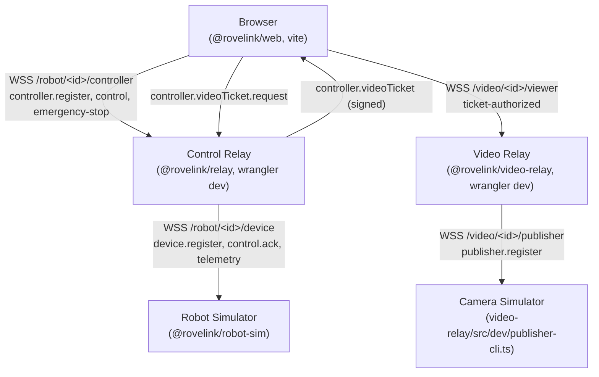

# Hardwareless Demo (`pnpm dev:demo`)

Problem 8B. Runs a complete local RoveLink stack — control relay, video
relay, web dashboard, a desktop robot simulator, and a simulated camera
publisher — with **no ESP32, no ESP32-CAM, and no DualSense required**. This
document covers what the demo actually runs, what in it is real versus
simulated, and where the simulator's fidelity intentionally stops. For the
wire protocol and auth model themselves, see [protocol.md](protocol.md),
[video-protocol.md](video-protocol.md), and [authentication.md](authentication.md)
— the demo does not change any of it.

## Quick start

```bash
pnpm install
pnpm dev:demo
```

The terminal prints a `Demo controller key` — open the printed Web URL and
type that key into the normal login form. See the root
[README](../README.md#try-rovelink-without-hardware) for the short version.

## Architecture



Every arrow is the exact same wire protocol and route a physical ESP32,
ESP32-CAM, and browser would use against a deployed relay — `@rovelink/demo`
(the `dev:demo` orchestrator) only decides what to spawn, in what order, and
with which ephemeral credentials. It never sits on the data path itself.

## What's real vs. simulated

**Real, exactly as in production:**

- Browser, control protocol, and every message type in `protocol.md`
- Device/controller/video-publisher authentication (`verifyCredential`,
  shared-secret comparison) — the real relay decides pass/fail, never the
  simulator (see `robot-sim/src/client.ts`'s doc comment)
- `controller.session` issuance, seq/session/disarmed-baseline gating
- Relay (`RobotRoom`) and video relay (`VideoRoom`) Durable Object behavior,
  including presence (`room` broadcasts), the stale-socket sweep, and TTL
- `control.ack` / `emergency-stop.ack` and the RTT measurements built on them
  (Problem 8A)
- Video ticket issuance, JPEG frame transport, and the viewer ACK/
  latest-frame-wins flow
- `GET /health` on both relays

**Simulated:**

- Motors (no physical actuation — `robot-sim/src/motor.ts` computes the same
  `differentialMix()` wheel values the firmware would, logged, not applied
  to anything)
- Gripper hardware
- The camera sensor (synthetic JPEG frames, watermarked "ROVELINK SIMULATED
  FEED" — see `video-relay/src/dev/simulated-frame.ts`)
- RSSI (a plausible fixed-range value, not a real radio measurement)
- WiFi/radio characteristics, physical power/brownout behavior

Never mistake a passing demo run for hardware validation of motors, the
gripper, the camera sensor, or RF behavior.

## Robot simulator fidelity

`robot-sim/` ports the externally observable subset of
`firmware/rovelink_device/rovelink_device.ino`'s control logic
(`applyControlFrame`/`onSessionChanged`) to TypeScript — not an ESP32 CPU or
Arduino runtime emulation. Kept:

- authenticated `device.register`
- `controller.session` adoption, with seq reset and the disarmed-baseline
  gate (an armed=true frame is rejected until a disarmed frame establishes
  the new session's baseline — same as firmware, including that the
  rejected frame's `seq` is still consumed)
- wrong-session and stale/duplicate-seq rejection
- arm/disarm, throttle, steering, gripper state
- emergency-stop (session/seq-independent, always acked immediately)
- the TTL watchdog (`docs/safety.md`)
- periodic telemetry at firmware's cadence (~300 ms)
- reconnect with bounded exponential backoff (1s→30s), shaped like
  `transport.cpp`'s, not byte-identical

Intentionally NOT ported: WiFi association, TLS/CA validation, GPIO, PWM
timing, brownout/power behavior, or anything else that only exists because
real hardware exists. See `robot-sim/src/device-state.ts`'s module doc
comment for the same list in code.

### Chaos / presence testing

The simulator supports exercising Problem 8A's presence model without
physical hardware:

- a small stdin console (`status` / `unresponsive` / `resume` /
  `disconnect` / `reconnect`) for interactive use
- `--ack-delay-ms` (alias `--robot-latency`): simulated control-processing
  delay before `control.ack` is sent. **Never** applied to
  `emergency-stop.ack` — E-stop is always acked immediately, so a "slow
  device" demo can never look like a slow E-stop. This is what lets
  `pnpm dev:demo --robot-latency=200` visibly raise Control RTT while Relay
  RTT (browser↔relay only, no robot involved) stays low — useful for
  teaching the difference between the two RTTs.
- `--drop-ack-percent` (optional `--seed` for determinism): deliberately
  drops a percentage of earned `control.ack`s to simulate ack loss on the
  wire, without affecting whether the frame was actually applied

"Unresponsive" mode keeps the WebSocket **physically open** but suppresses
every device-originated message (telemetry, `control.ack`,
`emergency-stop.ack`). Incoming frames still update internal state
(so a `resume` reports fresh, non-stale state) but nothing is sent while
unresponsive. That absence of evidence is exactly what the relay's stale
sweep and the browser's `UI_UNRESPONSIVE_THRESHOLD_MS` (device-health.ts,
Problem 8A) are built to detect — so this exercises the real production
presence logic, never a UI state faked from the browser.

## Camera simulator

Reused as-is from Problem 7B: `video-relay/src/dev/publisher-cli.ts`. The
demo orchestrator only supplies its target URL, robot id, FPS, and the
ephemeral `VIDEO_PUBLISHER_SECRET` — see that file's own doc comment for
frame generation details.

## Ephemeral secrets

`pnpm dev:demo` generates fresh random `DEVICE_SECRET`, `CONTROLLER_SECRET`,
`VIDEO_TICKET_SECRET`, and `VIDEO_PUBLISHER_SECRET` values on every run
(`demo/src/secrets.ts`) and hands each relay only what it needs through a
`wrangler dev --env-file <tmp>` file (`demo/src/env-file.ts`) — a temporary,
mode-0600 file under `os.tmpdir()`, never `relay/.dev.vars` or
`video-relay/.dev.vars`, removed on both clean shutdown and startup failure.
Confirmed empirically that `--env-file` satisfies `wrangler dev` without
ever needing a `.dev.vars` file to exist. `DEVICE_SECRET` and
`VIDEO_PUBLISHER_SECRET` reach the robot/camera simulators as process env
vars (standard child-process secret passing — visible via
`/proc/<pid>/environ` to the same OS user, same as any subprocess secret,
but never visible in `ps`/`/proc/<pid>/cmdline` argv). Only
`CONTROLLER_SECRET` is ever printed, because the human operator has to type
it into the login form themselves — see `demo/src/main.ts`'s `printReady()`.

## Ports

Stable documented defaults: control relay `8787`, video relay `8788`, web
`5173` (plus each `wrangler dev` instance's own devtools inspector port,
derived as `<port> + 100` to avoid the two relays colliding on wrangler's
shared default). All overridable — `pnpm dev:demo --control-port=... ` or
the matching `CONTROL_PORT`/`VIDEO_PORT`/`WEB_PORT` env vars
(`demo/src/config.ts`). Checked for conflicts before anything is spawned;
the demo never kills whatever is already listening.

The web dev server binds `127.0.0.1` only during the demo, overriding
`web/vite.config.ts`'s `server.host: true` (which exists for other
workflows, e.g. testing from a phone on the LAN during hardware bring-up) —
see the comment in `demo/src/main.ts`. Both relays already default to
localhost-only under `wrangler dev`.
